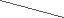
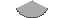
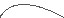
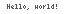

<style>
img.full {
    width: 100%;
    max-width: 100%;
    margin: 0;
    padding: 0;
    image-rendering: pixelated;
    border-radius: 1em;
    box-shadow: 0 0 1em rgba(0, 0, 0, 0.2);
    padding: 1em;
}
</style>

# Drawing things

The `Canvas` class provides a number of methods for drawing things on the canvas. These methods are used to draw pixels, lines, rectangles, circles, ellipses, arcs, Bézier curves, triangles, and text.

## Drawing and reading pixels

The `set_pixel` method sets the color of a single pixel on the canvas.

```ruby
canvas.set_pixel(160, 90, 10) # in palette mode
canvas.set_pixel(160, 90, 0, 255, 0) # in RGB mode
```

To read the color of a pixel, use the `get_pixel` method.

```ruby
color = canvas.get_pixel(160, 90)
```

Depending on the color mode, the `get_pixel` method returns either a palette index or an array of RGB values.

## Setting the current color

The `set_color` method sets the color that will be used by all subsequent drawing operations.

```ruby
canvas.set_color(10)
```

You can omit the color argument in the `set_pixel` method if you have previously set the color using the `set_color` method.

```ruby
canvas.set_color(10)
canvas.set_pixel(160, 90)
```

## Drawing lines

Use the `draw_line` method to draw a line between two points.

```ruby
canvas.set_color(10)
canvas.draw_line(10, 10, 100, 50)
```

<!-- code begin
Pixelflow::Canvas.new(64, 18, :palette) do
    set_color(15)
    fill_rect(0, 0, 63, 17)
    set_color(8)
    draw_line(0, 0, 63, 17)
end
code end -->

## Drawing rectangles

Use the `draw_rect` and `fill_rect` methods to draw rectangles. Specify the coordinates of the upper-left corner and the lower-right corner of the rectangle.

```ruby
canvas.set_color(3)
canvas.fill_rect(10, 10, 100, 50)
canvas.set_color(10)
canvas.draw_rect(10, 10, 100, 50)
```

<!-- code begin
Pixelflow::Canvas.new(64, 18, :palette) do
    set_color(15)
    fill_rect(0, 0, 63, 17)
    set_color(7)
    fill_rect(0, 0, 63, 17)
    set_color(8)
    draw_rect(0, 0, 63, 17)
end
code end -->

## Drawing circles

Use the `draw_circle` and `fill_circle` methods to draw circles. Specify the center and the radius of the circle.

```ruby
canvas.set_color(3)
canvas.fill_circle(160, 90, 50)
canvas.set_color(10)
canvas.draw_circle(160, 90, 50)
```

<!-- code begin
Pixelflow::Canvas.new(64, 19, :palette) do
    set_color(15)
    fill_rect(0, 0, 63, 18)
    set_color(7)
    fill_circle(32, 9, 9)
    set_color(8)
    draw_circle(32, 9, 9)
end
code end -->

## Drawing ellipses

Use the `draw_ellipse` and `fill_ellipse` methods to draw ellipses. Specify the center, the horizontal radius, and the vertical radius of the ellipse.

```ruby
canvas.set_color(3)
canvas.fill_ellipse(160, 90, 50, 30)
canvas.set_color(10)
canvas.draw_ellipse(160, 90, 50, 30)
```
<!-- code begin
Pixelflow::Canvas.new(64, 19, :palette) do
    set_color(15)
    fill_rect(0, 0, 63, 18)
    set_color(7)
    fill_ellipse(32, 9, 16, 9)
    set_color(8)
    draw_ellipse(32, 9, 16, 9)
end
code end -->

## Drawing circular arcs

Use the `draw_arc` and `fill_arc` methods to draw arcs. Specify the center, the radius, the start angle, and the end angle of the arc.

```ruby
canvas.set_color(3)
canvas.fill_arc(160, 90, 50, 0, 180)
canvas.set_color(10)
canvas.draw_arc(160, 90, 50, 0, 180)
```

<!-- code begin
Pixelflow::Canvas.new(64, 18, :palette) do
    set_color(15)
    fill_rect(0, 0, 63, 17)
    set_color(7)
    fill_arc(32, 0, 18, 30, 150)
    set_color(8)
    draw_arc(32, 0, 18, 30, 150)
end
code end -->

## Drawing Bézier curves

Use the `draw_quadratic_bezier` and `draw_cubic_bezier` methods to draw quadratic and cubic Bézier curves, respectively.

```ruby
canvas.set_color(10)
canvas.draw_quadratic_bezier(10, 10, 50, 50, 100, 10)
canvas.draw_cubic_bezier(10, 10, 50, 50, 100, 50, 150, 10)
```

<!-- code begin
Pixelflow::Canvas.new(64, 18, :palette) do
    set_color(15)
    fill_rect(0, 0, 63, 17)
    set_color(8)
    draw_quadratic_bezier(0, 17, 16, -8, 63, 17)
end
code end -->

<!-- code begin
Pixelflow::Canvas.new(64, 18, :palette) do
    set_color(15)
    fill_rect(0, 0, 63, 17)
    set_color(8)
    draw_cubic_bezier(0, 17, 16, -8, 47, 30, 63, 0)
end
code end -->

## Drawing triangles

Use the `draw_triangle` and `fill_triangle` methods to draw triangles. Specify the coordinates of the three vertices of the triangle.

```ruby
canvas.set_color(3)
canvas.fill_triangle(10, 10, 100, 50, 50, 100)
canvas.set_color(10)
canvas.draw_triangle(10, 10, 100, 50, 50, 100)
```

<!-- code begin
Pixelflow::Canvas.new(64, 18, :palette) do
    set_color(15)
    fill_rect(0, 0, 63, 17)
    set_color(7)
    fill_triangle(10, 0, 52, 6, 31, 17)
    set_color(8)
    draw_triangle(10, 0, 52, 6, 31, 17)
end
code end -->

## Flood filling

The `flood_fill` method fills an area of the canvas with the current color. Specify the starting point of the fill operation.

```ruby
canvas.set_color(10)
canvas.draw_circle(110, 90, 50)
canvas.draw_circle(210, 90, 40)
canvas.flood_fill(160, 90)
```

<!-- code begin
Pixelflow::Canvas.new(64, 18, :palette) do
    set_color(15)
    fill_rect(0, 0, 63, 17)
    set_color(8)
    draw_circle(25, 12, 12)
    draw_circle(39, 12, 8)
    set_color(7)
    flood_fill(25, 14)
    flood_fill(39, 14)
end
code end -->

## Drawing text

Use the `draw_text` method to draw text on the canvas. Specify the position, the text to draw, the font name, and the scale factor.

```ruby
canvas.set_color(10)
canvas.draw_text(10, 10, "Hello, world!", "4x6", 2)
```

<!-- code begin
Pixelflow::Canvas.new(64, 14, :palette) do
    set_color(15)
    fill_rect(0, 0, 63, 13)
    set_color(8)
    draw_text(7, 4, "Hello, world!", "4x6", 1)
end
code end -->


Use `text_width` to get the width and height of a given text string in pixels.

```ruby
width = canvas.text_width("Hello, world!", "4x6", 2)
```

There are several built-in fonts available:

<!-- fonts start -->

#### 4x6


#### 6x10


#### 7x13


#### 7x13B


#### 8x13


#### 8x13B


#### 9x15


#### 9x15B


<!-- fonts end -->