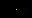

<style>
img.full {
    width: 100%;
    max-width: 100%;
    margin: 0;
    padding: 0;
    image-rendering: pixelated;
}
</style>

# Pixelflow Canvas (Ruby driver)

A virtual CRT for old school graphics programming in Visual Studio Code.

The Pixelflow Canvas is a simple library for creating pixel graphics, animations or interactive experiments in Ruby. It provides a canvas that you can draw on using a fixed palette of 256 colors or 24-bit RGB values. The canvas can be displayed in Visual Studio Code using the Pixelflow Canvas extension.

{: .info }
This is the documentation for the pixelflow_canvas rubygem which requires the [»Pixelflow Canvas«](https://marketplace.visualstudio.com/items?itemName=gymnasiumsteglitz.pixelflow-canvas) Visual Studio Code extension to work. You can find the documentation for the VS Code extension [here](https://specht.github.io/pixelflow_canvas_vscode/).

## Creating a canvas

There are two ways to work with a canvas.

### Working with an instance

Specify the width, height, and color mode (either `:palette` or `:rgb`) to create a new canvas:

```ruby
require 'pixelflow_canvas'

canvas = Pixelflow::Canvas.new(32, 18, :palette)
canvas.set_pixel(16, 9, 10)
```

This should produce the following output:

<!-- code begin
Pixelflow::Canvas.new(32, 18, :palette) do
    set_pixel(16, 9, 10)
end
code end -->

### Pass a block to the constructor

This method allows you to omit the `canvas` variable on every method call:

```ruby
Pixelflow::Canvas.new(320, 180, :palette) do
    set_pixel(160, 90, 10)
end
```

You can also use the `perform` method to run a block on an existing canvas:

```ruby
canvas = Pixelflow::Canvas.new(320, 180, :palette)
canvas.perform do
    set_pixel(160, 90, 10)
end
```

## Modes of operation

The following modes of operation affect how the canvas is working and how it is displayed.

### Color modes

There are two color modes: `:palette` and `:rgb`. In palette mode, the canvas uses a fixed palette of 256 colors and each pixel is represented by an index (0...255) into this palette. In RGB mode, each pixel is represented by a 24-bit RGB value.

The default color mode is `:rgb`. It can be changed by calling `set_color_mode`.

```ruby
set_color_mode(:palette)
```

### Double buffering

There are two drawing modes: `:direct` and `:buffered`. In direct mode, every pixel gets drawn immediately. In buffered mode, the canvas is drawn to an off-screen buffer and then copied to the screen when `flip` is called. Double buffering is useful for animations to prevent flickering.

The default drawing mode is `:direct`. It can be changed by calling `set_draw_mode`.

```ruby
set_draw_mode(:buffered)
```

{: .info }
If you get a black canvas in buffered mode, make sure to call `flip` at the end of your drawing code.

### Composition modes

There are three composition modes: `:copy`, `:add`, `:subtract` and `:multiply`.

- `:copy` copies the source pixel to the destination pixel
- `:add` adds the source pixel to the destination pixel
- `:subtract` subtracts the source pixel from the destination pixel
- `:multiply` multiplies the source pixel with the destination pixel

The default composition mode is `:copy`. It can be changed by calling `set_composition_mode`.

```ruby
set_composition_mode(:add)
```

{: .info }
Composition modes other than `:copy` require the canvas to be in RGB mode.

### Interpolation modes

There are two interpolation modes: `:nearest` and `:bilinear`. This mode only affects the display of the canvas in the Visual Studio Code extension.

The default interpolation mode is `:nearest`. It can be changed by calling `set_interpolation_mode`.

```ruby
set_interpolation_mode(:bilinear)
```
<!--
- Using masks
- Saving the canvas
- Event polling
-->